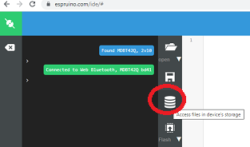
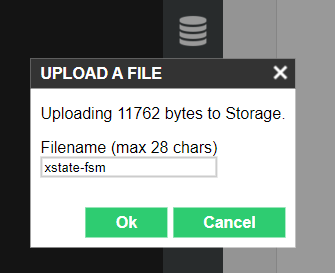
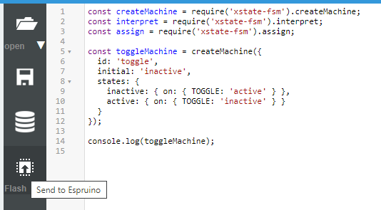

# XState-fsmPlus-Espruino

This repro contains a copy of the finite state machine, [XState/fsm](https://github.com/statelyai/xstate/tree/main/packages/xstate-fsm) with modifications necessary to run it as a module within the Espruino JavaScript Interpreter for Microcontrollers.  In addition the copy contains added functionality in support of a subset of the Statechart functionality found in the full XState/core package.

## (This repro is currently Work in Progress)

The current status is that a working version has been deployed and is available as per the implementation notes below.
Testing is continuing and examples are being created and published here within the examples folder.   Watch this space :)

**This software should be considered as experimental.**  
As such this software should be used for amusement only and specifically not be used for any mission critical or safety/health systems.    As per the license below this work is provided without warranty of any kind.  
 

## Goals

The goal of XState-fsmPlus-Espruino is to enable the advantages of a finite state machine approach (including a limited set of Statechart functions) to be demonstrated for the programming of Internet of Things (IOT) microcontrollers.  In a way that:

* Supports JavaScript as a mid-level scripting environment for the programming of IOT devices.
* Enables the existing diverse Esprunio module device library of sensors, actuators and other interface components to be incorporated into IOT devices driven by a FSM.
* Builds on resources available within the established open source communities of both XState and Esprunio.
* Works within the constraits of typical microcontroller resources.
* Is tested on a sample of low-end, connected, IOT microcontroller devices available today eg Esprunio and Espressif ESP32.  (noting that full XState Statechart Library is already enabled on the Raspberry Pi, running under Linux with Node.js)

## Features
XState-fsmPlus-Espruino contains all of the features of [@XState/fsm](https://github.com/statelyai/xstate/tree/main/packages/xstate-fsm) with a small set of additional features available within Statechart standards.  Below is an amended copy of the features table from [@XState/fsm](https://github.com/statelyai/xstate/tree/main/packages/xstate-fsm)

|                             | [@XState/fsm](https://github.com/statelyai/xstate/tree/main/packages/xstate-fsm)| **XState-fsmPlus-Espruino**  |[XState](https://github.com/statelyai/XState)   |
| --------------------------- | :-------------: | :----------------:  |:---------------------------------------------: |
| Finite states               |       ✅        |        ✅           |                   ✅                          |
| Initial state               |       ✅        |        ✅           |                   ✅                          |
| Transitions (object)        |       ✅        |        ✅           |                   ✅                          |
| Transitions (string target) |       ✅        |        ✅           |                   ✅                          |
| Delayed transitions         |       ❌        |        ❌           |                   ✅                          |
| Eventless transitions       |       ❌        |        ❌           |                   ✅                          |
| Nested states               |       ❌        |        ✅           |                   ✅                          |
| Parallel states             |       ❌        |        ❌           |                   ✅                          |
| History states              |       ❌        |        ❌           |                   ✅                          |
| Final states                |       ❌        |        ❌           |                   ✅                          |
| Context                     |       ✅        |        ✅           |                   ✅                          |
| Entry actions               |       ✅        |        ✅           |                   ✅                          |
| Exit actions                |       ✅        |        ✅           |                   ✅                          |
| Transition actions          |       ✅        |        ✅           |                   ✅                          |
| Parameterized actions       |       ❌        |        ❌           |                   ✅                          |
| Transition guards           |       ✅        |        ✅           |                   ✅                          |
| Parameterized guards        |       ❌        |        ❌           |                   ✅                          |
| Spawned actors              |       ❌        |        ❌           |                   ✅                          |
| Invoked actors              |       ❌        |        ❌           |                   ✅                          |

## Implementation

XState-fsmPlus-Espruino can be run in Esprunio on a microcontroller board by installing it as an Espruino module on the board. The module code file, XState-fsm.js  is available in this repository in the src folder.

See the link working with modules below for full details on working with modules in Esprunio.

In summary, to implement, assuming you are using the Espruino IDE (native version) and are connected to a board.  <https://www.espruino.com/Quick+Start+BLE#using-the-espruino-ide>

Download the module code file XState-fsm.js to your local machine from this repository. 
<https://github.com/SimonGAndrews/XState-fsm-Espruino/tree/main/src>

Within the IDE click the Device Storage Icon.

in the file open pop-up, navigate to the local copy of XState-fsm.js.  Click open.  Then in the 'Upload A file' pop-up enter the filename as XState-fsm  (WITHOUT any extension).

Click OK, the IDE will upload the file to the board, and it will be available in the boards non-volatile storage as an Espruino module.

.

The module can then be accessed with require statements as below.

(To Do - link to examples)

## References
* Statecharts an introduction: <https://statecharts.dev/>
* Documentation for XState: <https://XState.js.org/docs/>  (including FSM concepts)
* Documentation for XState/fsm: <https://XState.js.org/docs/packages/XState-fsm/#features>
  and <https://github.com/statelyai/XState/tree/main/packages/XState-fsm>

* Espruino:  <https://www.espruino.com/>  and <https://github.com/espruino>
* Esprunio Working with Modules: <https://www.espruino.com/Modules>
* Esprunio Index of modules (Devices etc) <http://www.espruino.com/modules/>

## Credits

Both XState and Esprunio are Open Source projects.

Esprunio is the product of Gordon Williams <https://en.wikipedia.org/wiki/Espruino>.  
To support the Esprunio project please see: <https://www.espruino.com/Donate>

XState is the product of David Khourshid and the XState community.  
To support the XState project please see: <https://opencollective.com/XState>

## License
XState/core is Copyright (c) 2015 David Khourshid and utilised here under its MIT license <https://github.com/statelyai/XState/blob/main/packages/core/LICENSE>

XState/fsm is Copyright (c) 2015 David Khourshid and utilised here under its MIT license
<https://github.com/statelyai/XState/blob/main/packages/XState-fsm/LICENSE>

The modifications to XState/core and XState/fsm provided here are Copyright (c) 2021 Simon Andrews and are provided for use under MIT License. <https://github.com/SimonGAndrews/XState-fsm-Espruino/blob/main/LICENSE>
